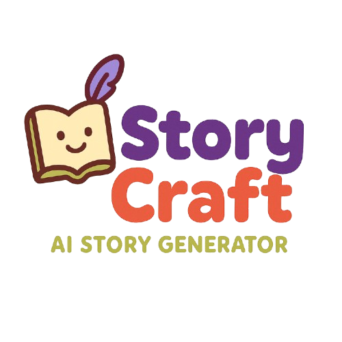

# StoryCraft: AI-Powered Stories for Kids

<div align="center">
  


_✨ Unleash your imagination with magical stories! ✨_

</div>

## 📱 App Demo

<!-- Add a screenshot or GIF of your app in action here -->

<p align="center">
  <i>Demo video coming soon!</i>
</p>

## ✨ Features

- **Create Custom Stories**: Generate unique, AI-powered stories for children based on prompts
- **Beautiful Illustrations**: Each story comes with AI-generated illustrations
- **Story Library**: Save and access all your favorite stories
- **User-Friendly Interface**: Designed with children and parents in mind
- **Story Audio**: Read or Listen to any story

## 📸 Screenshots

<div align="center">
  <p float="left">
    
     
    
  </p>
  
  <p float="left">
    
    
    
  </p>
</div>

## 🚀 Technologies

- React Native
- Expo
- TypeScript
- AI-powered story generation
- Context API for state management
- Custom theming system

## 📋 Prerequisites

- Node.js (v14 or later)
- npm or yarn
- Expo CLI
- iOS Simulator or Android Emulator (for development)

## 🔧 Installation

1. Clone the repository:

```bash
git clone https://github.com/yourusername/ai-story-frontend.git
cd ai-story-frontend
```

2. Install dependencies:

```bash
npm install
# or
yarn install
```

3. Start the development server:

```bash
npm start
# or
yarn start
```

4. Follow Expo instructions to run on your preferred device or emulator.

## 🌟 Usage

1. **Create a New Story**:

   - Tap on "Create New Story"
   - Enter your story preferences
   - Watch as the AI generates a custom story with illustrations

2. **Read Stories**:

   - Access your previously created stories in the "Story Library"
   - Tap on any story to start reading
   - Or **Listen** to the story

3. **Save**:
   - All stories are automatically saved to your library

## 🔮 Future Features

- Voice narration
- Interactive elements within stories
- Multiple language support
- Custom character creation
- Parent dashboard with reading statistics

## 👨‍💻 Contributing

Contributions are welcome! Please feel free to submit a Pull Request.

## 💖 Acknowledgments

- Made with love for young dreamers
- Special thanks to all contributors and testers

---

<p align="center">
  <i>Turn bedtime into an adventure with StoryCraft!</i>
</p>
